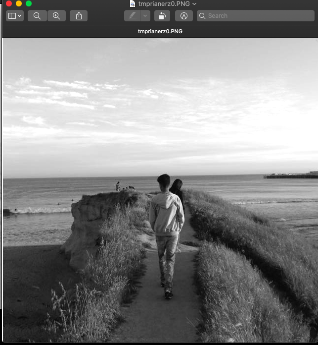

# Spacial Intensity Transformations

*CSE4019 Image Processing - Fall 2020 - Digital Assignment - 18BCE0715 - Sanjit*

## Environment and Dependencies

1. MacOS 10.15.6
2. Python 3.7.7
3. Pillow (only for input and output display)
4. argparse (for parsing command line arguments)
5. Numpy (pixel data manipulation)

## How to Run

Set up all dependencies

```
pip install -r requirements.txt
```

Run main.py with picture path

```
python main.py --input=./img/myPicture.png
```

Select the operation/transformation by entering the correct *number*.


Enter Parameters (and Constants) As Required By the selected transformation


## Transformations Functions Implemented

1. Image Negative
2. Log Transform
3. Power-Law Transform
4. Contrast Stretching
5. Gray-level Slicing
6. Bit Plane Splicing

All input parameters should be entered by the user as required by the corresponding transformation

## Sample input - Converted to Gray-scale on input


## Sample output

Output for each method contains the formula followed by the output image. Here are a few processed images for the sample input image.

### 1. Image Negative


### 2. Log Transform with c=50


### 3. Power-Law Transform with c=1 and $\gamma$	= 3


### 4. Contrast Stretching

#### with  r1=50, s1=60, r2=150, s2=180



#### with r1=50, s1=1, r2=50, s2=255 (Thresholding i.e it gives Binary Image )


### 5. Gray-level Slicing

#### without Background Slicing and limits = 80 to 130 and S=70 and background-clipped to 50


#### with Background Slicing and with limits = 80 to 130 and S=70


### 6. BitPlane Splicing (from plane 1 to 8 - LSB to MSB)


